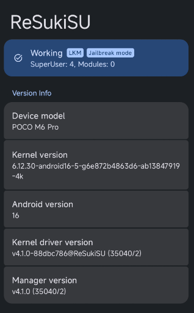

# GhostLock for POCO M6 Pro (emerald)

GhostLock (CVE-2026-43499) is a 15-year-old Linux kernel use-after-free in the
futex priority-inheritance code that lets any local user gain root. This
project uses it to root the POCO M6 Pro (MediaTek Helio G99 Ultra / MT6789)
and install KernelSU on a locked bootloader.

Kernel: `6.12.30-android16-5-g6e872b4863d6-ab13847919-4k`

## References

- Research: [IonStack part II: GhostLock, a stack-UAF in all Linux kernels since 2011](https://nebusec.ai/research/ionstack-part-2)
- Original PoC: [NebuSec/CyberMeowfia · IonStack/CVE-2026-43499](https://github.com/NebuSec/CyberMeowfia/tree/main/IonStack/CVE-2026-43499)
- KernelSU / ReSukiSU, the LKM manager that provides the root layer.
- Based on: [JoinChang/ghostlock-oneplus](https://github.com/JoinChang/ghostlock-oneplus)

## License

For authorized security research and educational purposes only.
